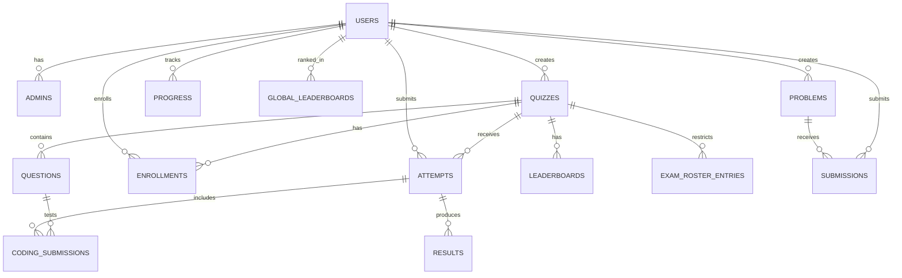

# CSE Project Show Demo Guide

Project: Online Quiz Management System

Use this as your 10-minute recording script. Keep the screen zoomed in enough that code, SQL, and UI text are readable.

## Submission Checklist

- Demo video: around 10 minutes.
- Database DDL file: `docs/database-ddl.sql`.
- SQL demo file for recording: `docs/sql-demo-queries.sql`.
- Upload the video to Google Drive and set sharing to "Anyone with the link can view".
- Submit the Google Form using the team leader account.

## 0. Before Recording

1. Start MySQL.
2. Open the project folder.
3. Start the app:

```bash
npm start
```

or for development:

```bash
npm run dev
```

4. Open:

```text
http://localhost:3000
```

5. Prepare one admin, one approved teacher, one student, at least one published quiz, and one submitted attempt.

## 1. Project Overview - 1 Minute

Say:

"Our project title is Online Quiz Management System. The objective is to manage online exams for admins, teachers, and students. The problem is that manual quiz creation, student enrollment, score calculation, review, and leaderboard tracking are time-consuming and error-prone. Our system solves this by providing role-based dashboards, quiz creation, student enrollment, secure exam attempt flow, automatic and manual grading, progress tracking, and leaderboard reports."

Show:

- Home page.
- Login/register page.
- Mention three roles: admin, teacher, student.

## 2. Database Design - 3 Minutes

### ER Diagram

Show this logical ER diagram in your slide or Markdown preview:



### Main Relations

Explain these tables:

- `users`: stores admin, teacher, and student accounts.
- `admins`: stores admin permission records.
- `quizzes`: stores exams created by teachers.
- `questions`: stores quiz questions.
- `enrollments`: links students to quizzes.
- `attempts`: stores submitted quiz attempts.
- `results`: stores final marks, percentage, pass/fail status, and grade.
- `progress` and `global_leaderboards`: store student progress and ranking.
- `leaderboards`: stores quiz-level leaderboard data.
- `exam_roster_entries`: stores allowed student IDs for restricted exams.
- `problems`, `submissions`, `coding_submissions`: support coding practice and coding exams.
- `sessions`: stores login sessions in MySQL.

### Normalization

Say:

"In 1NF, each major entity has its own table, such as users, quizzes, questions, attempts, and results. Repeating student enrollments and quiz attempts are stored as separate rows instead of multiple values in one user row.

In 2NF, non-key attributes depend on the full primary key. For example, quiz title and duration depend on the quiz id, while attempt score and percentage depend on the attempt id.

In 3NF, transitive dependencies are separated. Teacher information is not repeated in quizzes; quizzes store only `createdBy`. Student information is not repeated in attempts; attempts store only `student`. Result and leaderboard data are derived from attempts and stored separately for reporting.

Some flexible exam payloads, such as answer snapshots and test cases, are stored as long text JSON in the current implementation because question types are dynamic. The core transactional entities are separated into relational tables."

## 3. SQL Query Demonstration - 3 Minutes

Open `docs/sql-demo-queries.sql` and run these:

1. Join query: attempts with student, quiz, and teacher.
2. Aggregation and grouping: average quiz score and pass count.
3. `HAVING`: teachers with at least two published exams.
4. Subquery: students who scored above their quiz average.
5. Best attempt query using a correlated subquery.
6. View query: `teacher_quiz_summary`.
7. View query: `student_performance_summary`.
8. Index query: `EXPLAIN` on `attempts(student, quiz, submittedAt)`.
9. Trigger explanation: result grade is automatically calculated from percentage.

Say:

"Our database uses indexes on frequent lookup columns such as quiz status, teacher id, student id, quiz id, submitted date, leaderboard rank, and submission status. These indexes improve dashboard, history, leaderboard, and analytics queries."

## 4. Core Functionalities Demonstration - 3 Minutes

Show this workflow:

1. Admin:
   - Login as admin.
   - Show dashboard.
   - Approve teacher or manage users.

2. Teacher:
   - Login as teacher.
   - Create quiz.
   - Add multiple-choice, true/false, short-answer, or coding question.
   - Publish quiz.
   - Show analytics, attempts, leaderboard, and manual review.

3. Student:
   - Login as student.
   - Browse exams.
   - Enroll in a quiz.
   - Attempt quiz.
   - Submit answers.
   - View result, history, progress, and leaderboard.

4. Coding practice:
   - Open coding problems.
   - Submit code.
   - Show teacher review for coding submission.

## Form Submission Fields

Based on the form page, prepare these values:

- Course: CSE 3522: Database Management Systems Laboratory
- Section: your section
- Team Name
- Student IDs of all members
- Name of team leader
- Student ID of team leader
- Email address of team leader
- Contact number of team leader
- Main idea: "An online quiz management system with role-based admin, teacher, and student workflows, MySQL-backed quiz data, grading, progress tracking, and leaderboards."
- Project Video Drive Link

Only the team leader needs to submit the form.
